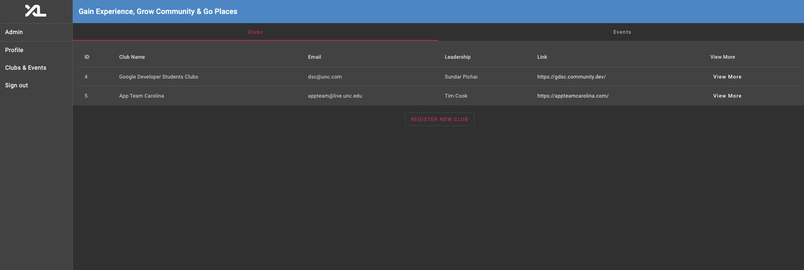
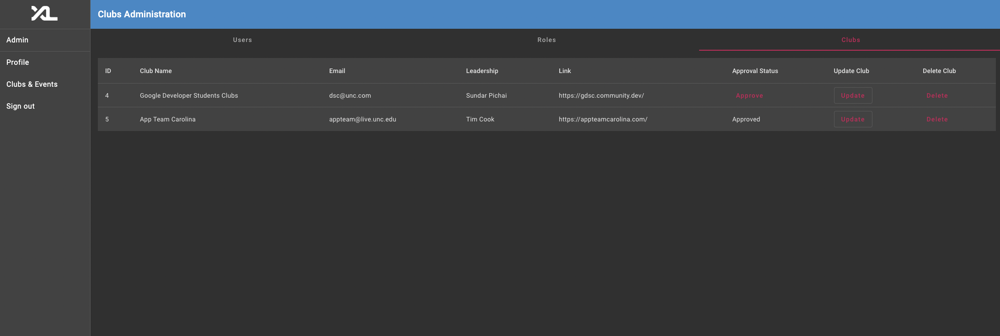

# Code Documentation: CSXL Clubs & Events Management Feature

## Authors
- Junead Khan ([@juneadkhan](https://github.com/juneadkhan))
- Awab Masroor ([@secretstf](https://github.com/secretstf))
- Wid Alsadoon ([@WidAlsa0](https://github.com/widalsa0))
- Haad Khan ([@haadk1](https://github.com/haadk1))

## Overview
The CSXL Clubs & Events Management Feature is a web application that enables users to browse, create and join clubs on the CSXL website, as well as to create and attend events for these clubs. It also allows administrators to review and approve new clubs and events, and to manage existing ones. This feature is designed for the community of CSXL website users who are interested in finding and participating in extracurricular activities related to computer science, as well as for the club executives who want to organize and promote their clubs and events. The feature aims to provide a user-friendly and intuitive interface for both end users and administrators, and to integrate seamlessly with the existing CSXL website.

## High-Level Functions
| High-Level Functions | Description |
| --- | --- |
| View Clubs | Users can view a list of all existing clubs on the CSXL website. |
| Add New Clubs | Users can add new clubs by providing information such as club name, website, contact information, etc. |
| Add Events for Clubs | Users can add events for a particular club by providing information such as event name, linked club, etc. |
| Approve New Clubs | Administrators can approve new club requests submitted by users. |
| Update Clubs | Administrators can update the details of an individual club. |
| Delete Clubs | Administrators can delete an individual club. |

## Admin CRUD

An administrator can perform CRUD (Create, Read, Update, Delete) operations on clubs in the CSXL website. They can create a new club by providing information such as club name, website, contact information, etc. They can update the details of an individual club such as its name or contact information. They can delete an individual club if it is no longer needed. They can also view a list of all existing clubs on the CSXL website and read more about each club’s details. All of these actions can be performed at /admin/clubs on the CSXL website.

## Implementation Notes
The CSXL Club Management Feature is implemented using the following database/entity-level representation:

- Club: Entity that stores information about a particular club, such as club name, website, contact information, etc.
- Event: Entity that stores information about a particular event, such as event name, associated club, etc.
- User: Entity that stores information about a user, such as name, permissions, etc.
- Permission: Entity that stores information about which users have which permissions and roles.

The feature is designed as a web-based application using a client-server architecture. The front-end is implemented using HTML, CSS, JavaScript and the Angular Framework with rxjs, while the back-end is implemented using Python and Flask. The data is stored in a PostgreSQL database.

An interesting design choice that the team made was to require club requests to be approved by administrators. This was done to ensure that the information provided by users is accurate and appropriate for the CSXL community.

## Development Concerns
If a new developer wanted to start working on the CSXL Club Management Feature, the following guidance or overview would be given to get them started:

- The front-end code is located in the `frontend/` folder and is primarily written in HTML, CSS, and JavaScript.
- The back-end code is located in the `backend/` folder and is primarily written in Python using the Flask framework.
- The database schema is defined in the `backend/models` folder using SQLAlchemy.
- The server can be started by running `honcho start` from the command line.

To get started, the new developer would need to clone the project repository in a Docker DevContainer.

## Future Work
Given more time, the CSXL Club Management Feature could be taken in the following directions:

- Add support for event RSVPs and attendance tracking.
- Add support for searching and filtering clubs by category, location, etc.
- Allow users to be affiliated with a club
- Improve the user interface and experience to make it more intuitive and user-friendly.